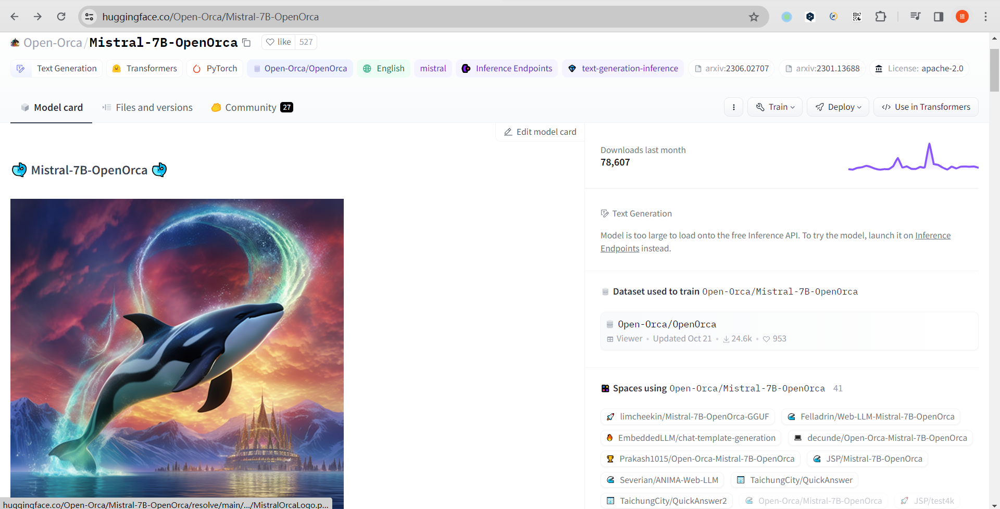
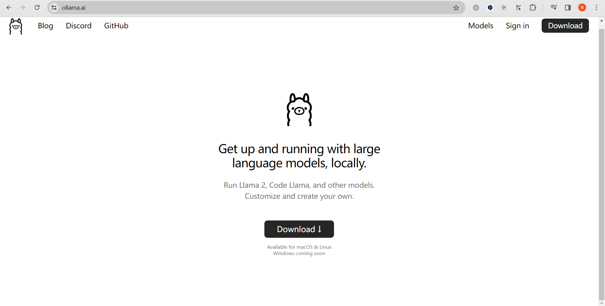
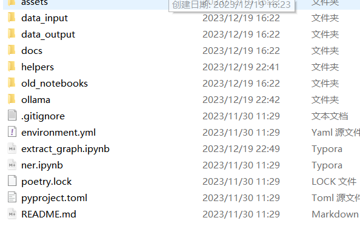

这段时间我研究一个能将任何文本语料库转换为知识图谱的代码库，[地址在此](https://github.com/rahulnyk/knowledge_graph)。在这篇文章里最鲜明的特征就是使用AIGC(Artificial Intelligence Generated Content)技术辅助开发。

根据作品创建简单知识图谱的一般流程：

	1. 清理文本语料库
	1. 从作品中提取概念和实体
	1. 提取实体之间的关系
	1. 转换图形模式
	1. 填充节点（概念）和边（关系）
	1. 可视化和查询

而作者的流程(将任何文本语料库转换为知识图谱)：

1. 首先需要一篇PDF文章作为数据输入
2. 使用Python的langchain库将PDF转变为txt文本
3. 将文本语料库分割成块。为每个文本块分配一个chunk_id
4. **对于每个文本块，使用 LLM大模型 提取概念及其语义关系。将这种关系的权重定为 W1。**同一对概念之间可能存在多种关系。每种关系都是一对概念之间的边。
5. **考虑到出现在同一文本块中的概念也是通过上下文的邻近性联系在一起的。给这种关系赋予 W2 的权重**。请注意，同一对概念可能出现在多个文本块中。
6. **将相似的概念对分组，求和它们的权重，然后将它们的关系连接起来。**因此，现在任何一对不同的概念之间都只有一条边。这条边有一定的权重，其名称为关系列表。

- 在上述流程中，使用 **Mistral 7B Openorca**(一种轻量级、无GPT的LLM大模型) 从文本块中提取概念。它能很好地遵循系统提示指令。
- 并且一般接入外界API需要联网服务，但是这里是通过**Ollama**(一种在本地托管任何大模型的工具，可惜还没有发行windows版本)。这样就实现了离线部署
- 因为知识图谱展示需要强大的渲染能力，一般只能由网页提供。但是Python中有个Pyvis库，可以使用 python 生成 Javascript 图形可视化，因此最终的图形可以托管在网络上(避免编写麻烦的前端代码)

- data_input：是输入的PDF以及处理完成的txt
- data_output：处理txt后生成的文本语料库(以csv格式存储)
- docs：最后展示的index.html
- helpers：编写跟LLM大模型交互的函数以及相应的提示词
- ollama：编写在本地托管的ollama脚本